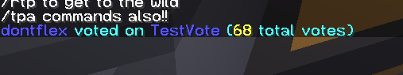
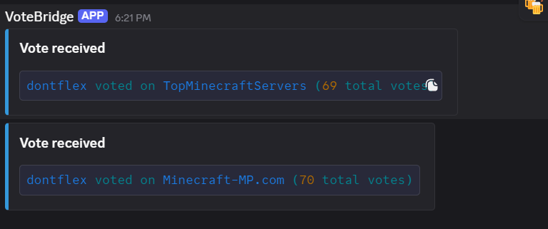

# VoteBridge

A lightweight Fabric mod that bridges vote events from **VoteListener** into Minecraft chat and Discord with full placeholder and color support.

## Why It Exists

VoteListener includes useful placeholders such as:

```text
%votelistener:vote_count%
```

While these placeholders work correctly in Minecraft, existing chat relay solutions did not provide the formatting and placeholder support needed for vote announcements.

VoteBridge was created to solve this problem by providing a mod-level command handler that:

1. Resolves Placeholder API variables via **PB4 Placeholder API**.
2. Constructs a valid JSON `/tellraw` message.
3. Executes the `/tellraw` command through the server console.
4. Sends a matching notification directly to Discord through a webhook.
5. Preserves vote counts, formatting, and colors across both Minecraft and Discord.

## What It Does

When a player votes through a registered site (e.g. TopMinecraftServers, Minecraft-MP, MCTools, etc.), VoteListener triggers the internal `voteannounce` command with the voting player and service name as arguments.

The VoteBridge mod handles the `/voteannounce` command and:

1. Fetches the player context for placeholder expansion.
2. Resolves `%votelistener:vote_count%` using the PB4 Placeholder API.
3. Formats a clean, colored `/tellraw` message:



4. Executes the `/tellraw` command as the server console so all players receive the formatted message.
5. Sends a Discord webhook notification using ANSI-colored formatting.



## VoteListener Configuration

Example `votelistener.json`:

```json
{
  "commands": [
    "execute as ${username} run voteannounce ${username} ${serviceName}"
  ]
}
```

## Discord Webhook Configuration

On first launch, VoteBridge creates:

```text
config/votebridge/config.json
```

Edit the file and add your Discord webhook URL:

```json
{
  "webhookUrl": "https://discord.com/api/webhooks/your_webhook_here"
}
```

If the webhook URL is left blank, VoteBridge will continue to function normally in Minecraft and simply skip Discord notifications.

## Internal Command

VoteBridge registers:

```text
/voteannounce <player> <service>
```

Example:

```text
/voteannounce Steve TopMinecraftServers
```

This command is primarily intended for use by VoteListener, but can also be used manually for testing.

## Dependencies

- **Minecraft** 26.1.2
- **Java** 25
- **Fabric Loader** 0.18.4+
- **Fabric API** 0.150.0+26.1.2
- **PB4 Placeholder API** 3.0.0+26.1
- **VoteListener** 26.1.x

## Features

- VoteListener integration
- PB4 Placeholder API integration
- Automatic vote count resolution
- Colored Minecraft chat messages
- Discord webhook notifications
- ANSI-colored Discord output
- Lightweight server-side Fabric mod
- No database required

## License

MIT
